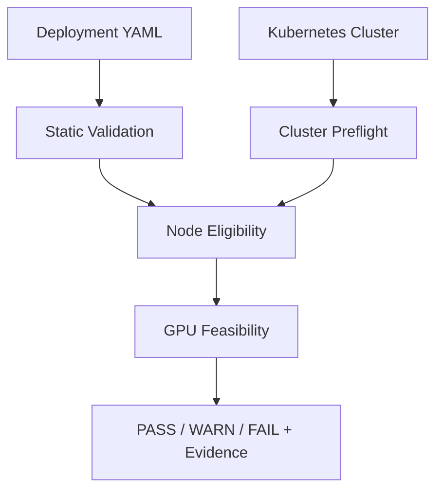

# GPUDeploy Guard

**Kubernetes GPU/LLM workload를 배포하기 전에 YAML과 실제 cluster 상태를 검사해 배포 실패 원인을 미리 잡는 deterministic Python CLI.**

## Problem

Kubernetes API가 Deployment object를 생성해도 GPU capacity, selector, affinity,
taint/toleration 조건이 맞지 않으면 Pod는 Pending 상태로 남을 수 있습니다.
GPUDeploy Guard는 apply 전에 manifest와 실제 cluster snapshot을 함께 검사합니다.

## What it checks

| 명령 | 검사 범위 |
|---|---|
| `check FILE` | GPU limit, CPU/Memory request·limit 형식, Startup/Readiness/Liveness Probe |
| `cluster-check` | kubectl, current context, API 연결, Ready Node, `nvidia.com/gpu` allocatable, Device Plugin Pod 존재 |
| `workload-check FILE` | Static 검사 + Ready/nodeName/nodeSelector/required nodeAffinity/cordon/taint 조건 + 단일 Node GPU fit |

Device Plugin 검사는 이름/label 기반 Pod 존재 확인이며 runtime health 검사가 아닙니다.
Exit code는 0=PASS/WARN, 1=rule FAIL, 2=input/CLI error입니다.

## Why it matters

**apply 이후 Pending 원인을 찾는 대신 apply 전에 같은 실패 조건을 보여 줍니다.**
결과는 PASS/WARN/FAIL JSON과 실제 관찰값으로 출력되므로 CI와 장애 분석 기록에 사용할 수 있습니다.

## Verified evidence

| 검증 항목 | observed 결과 |
|---|---|
| Tests | 로컬 pytest **509 passed** |
| Final CI | [GitHub Actions run 36883802291](https://github.com/eunsu7997/gpu-deploy-guard/actions/runs/36883802291) — SUCCESS |
| Host GPU | NVIDIA GeForce RTX 4060 인식 |
| Docker GPU | CUDA 컨테이너에서 GPU access 확인 |
| CUDA compute | NVIDIA vector addition `Test PASSED` |
| 현재 kind 환경 | Kubernetes API 연결 및 Ready Node 확인 |
| Kubernetes GPU resource | CPU-only kind Node에 `nvidia.com/gpu` capacity/allocatable 미노출 |
| Preflight | `GPU capacity insufficient: allocatable=0, required=2`, exit 1 |
| Actual scheduler | `Insufficient nvidia.com/gpu`로 Pod Pending |
| Comparison | Preflight와 scheduler가 같은 GPU capacity 부족을 보고하여 **MATCH** |

Docker GPU access와 CUDA compute 성공은 Kubernetes GPU workload 배치 성공을 의미하지 않습니다.

## Preflight vs Actual Scheduler

`examples/good/workload_two_gpu.yaml`은 GPU 2개를 요청합니다.

| 단계 | 결과 |
|---|---|
| GPUDeploy Guard | `node_eligibility=FAIL`, `gpu_feasibility=FAIL` |
| Predicted reason | `GPU capacity insufficient: allocatable=0, required=2` |
| `kubectl apply` | Deployment object 생성 |
| Pod | `Pending`, Node 미할당, 컨테이너 미실행 |
| Scheduler Event | `0/1 nodes are available: 1 Insufficient nvidia.com/gpu.` |
| 판정 | **MATCH** |

apply 성공은 workload 실행 성공이 아닙니다.
원문은 [preflight](evidence/deployment-compare/preflight.txt),
[Pod describe](evidence/deployment-compare/pod-describe.txt),
[scheduler Events](evidence/deployment-compare/scheduler-events.txt)에 보존되어 있습니다.

## Architecture



- Static Validation은 subprocess를 호출하지 않습니다.
- Cluster Preflight는 조회 전용 kubectl 명령만 사용합니다.
- Node snapshot은 eligibility와 feasibility에서 재사용합니다.

## Representative test cases

1. **Single-node fit:** GPU request=2, Node A=1, Node B=1이면 cluster 합계가 2여도 한 Node가 요청을 충족하지 못하므로 FAIL입니다.
2. **Selector before capacity:** GPU 4 Node가 selector mismatch이고 GPU 1 Node만 match하면 request=2는 FAIL입니다.
3. **Taint/toleration:** GPU capacity가 충분해도 `NoSchedule` taint를 toleration하지 못한 Node는 후보에서 제외합니다.
4. **Required nodeAffinity:** terms는 OR, expressions는 AND로 평가하며 `In`, `NotIn`, `Exists`, `DoesNotExist`, `Gt`, `Lt`를 검증합니다.

대표 구현 검증은 [feasibility tests](tests/test_feasibility.py),
[eligibility tests](tests/test_eligibility.py),
[affinity tests](tests/test_affinity.py)에 있습니다.

## Quick Start

Python 3.10 이상과 프로젝트 루트를 기준으로 실행합니다.

```powershell
python -m venv .venv
.\.venv\Scripts\python.exe -m pip install -e ".[dev]"

.\.venv\Scripts\python.exe -m gpu_guard check examples/good/probes_complete.yaml
.\.venv\Scripts\python.exe -m gpu_guard cluster-check
.\.venv\Scripts\python.exe -m gpu_guard workload-check examples/good/workload_two_gpu.yaml
```

현재 저장된 CPU-only kind evidence에서는 `cluster-check`가 GPU 관련 WARN과 exit 0,
`workload-check`가 GPU capacity 부족 FAIL과 exit 1을 반환했습니다.
결과는 cluster 상태에 따라 달라집니다.

## Limitations

- `status.allocatable`은 Kubernetes가 광고한 capacity이며 실시간 free GPU가 아닙니다.
- 단일 Pod가 단일 Node에 들어가는지만 검사하며 replicas 전체 동시 배치는 계산하지 않습니다.
- preferred nodeAffinity, Pod affinity/anti-affinity, topologySpreadConstraints는 지원하지 않습니다.
- ResourceQuota, PriorityClass/preemption, PodDisruptionBudget은 검증하지 않습니다.
- MIG, Dynamic Resource Allocation, GPU sharing/time-slicing은 지원하지 않습니다.
- multi-node distributed inference, MPI, Ray, node 간 tensor parallel은 지원하지 않습니다.
- 실제 GPU Kubernetes Node의 scheduling 성공은 **NOT VERIFIED**입니다.
- 실제 GPU Pod 및 vLLM Pod 실행은 **NOT VERIFIED**입니다.

## Evidence

| 범위 | 주요 파일 |
|---|---|
| Live CPU-only kind | [environment](evidence/live-cluster/environment.txt), [cluster-check](evidence/live-cluster/cluster-check.json), [workload-check](evidence/live-cluster/workload-check.json) |
| Host/Docker GPU boundary | [summary](evidence/gpu-boundary/summary.txt), [CUDA compute](evidence/gpu-boundary/docker-gpu-compute.txt), [Kubernetes Node](evidence/gpu-boundary/kubernetes-node-gpu.txt) |
| Preflight vs scheduler | [summary](evidence/deployment-compare/summary.txt), [apply](evidence/deployment-compare/apply.txt), [scheduler Events](evidence/deployment-compare/scheduler-events.txt) |

Evidence에는 kubeconfig 전체, token, certificate, private key 또는 Secret 값을 저장하지 않았습니다.

## CI / Test

- Local: Python 3.14.7, pytest 9.1.1, **509 passed**
- CI: Ubuntu / Python 3.12, [CI Validation SUCCESS](https://github.com/eunsu7997/gpu-deploy-guard/actions/runs/36883802291)
- Workflow: [.github/workflows/ci.yml](.github/workflows/ci.yml)
- CI 범위: 전체 pytest, Static good exit 0, Static bad exit 1, validation artifact 업로드
- CI는 실제 Kubernetes API나 GPU Node에 연결하지 않습니다.

## Tech Stack

- Python, PyYAML, pytest
- kubectl, Kubernetes, kind
- GitHub Actions
- Docker Desktop, WSL2, NVIDIA CUDA — **validation environment / evidence only**

세부 규칙, 단계별 테스트 증가, 당시 환경과 구현 기록은
[Development History](docs/development-history.md)에 보존되어 있습니다.
